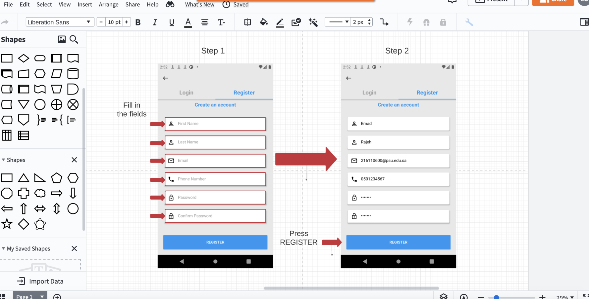
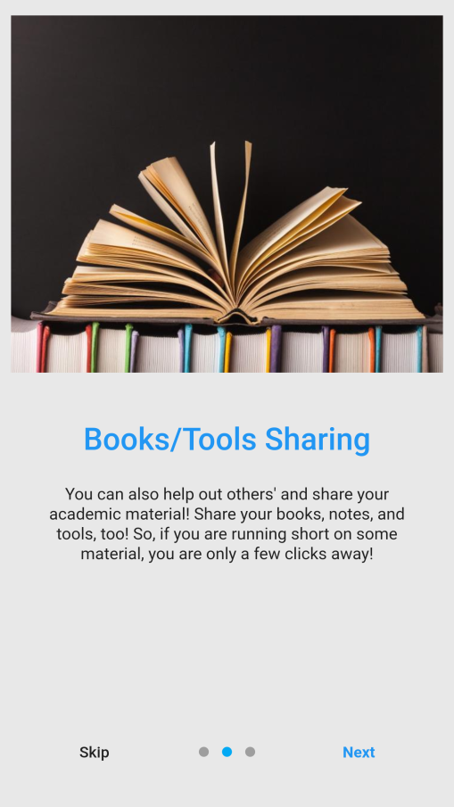
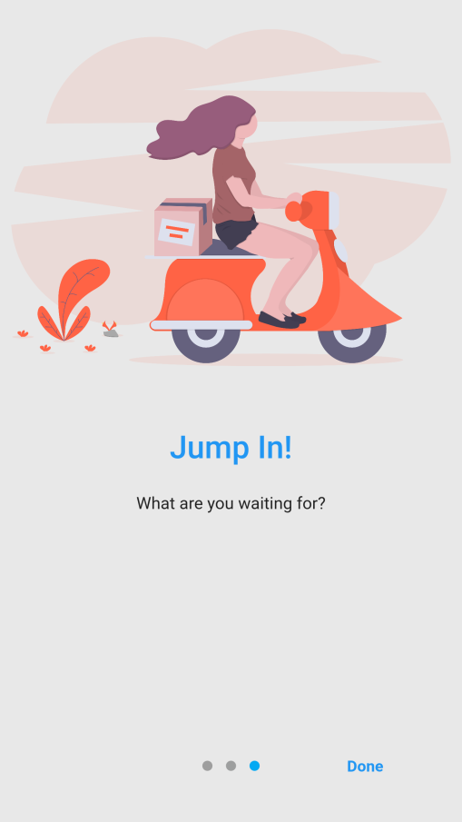
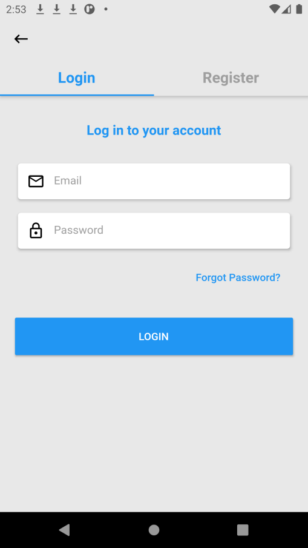
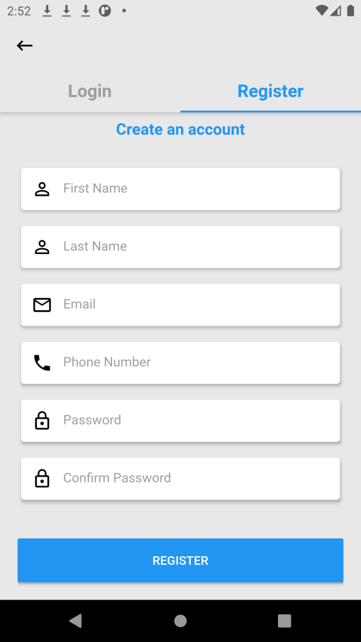

# Tuetok App (Oct. 2020 – Nov. 2020)

## Project Overview
Tuetok is a mobile application developed to address a specific need within the university community. The app empowers struggling students by providing them with a platform for buying and selling used books as well as browsing for tutors. The app allows students to register, sign up, upload books for sale, and elect themselves as tutors. The app was designed to be user-friendly and efficient. Through this project, we demonstrated our ability to effectively collaborate and communicate to deliver a functional and successful application.

## Features
- Registration System
- Register, Login, Edit Profile, Post book, Post for Tutor 
- CRUD functionality for Tutor and book posts
- Group chat feature

## Technologies
- Flutter
- Dart
- Firebase Database

## Demo

<h3 align="center"> Design Phase </h3>

<h3 align="center"> Splash & Onboarding Screens </h3>

<h3 align="center"> Cont'd Onboarding Screens </h3>

<h3 align="center"> Sign In & Profile Screens </h3>

<h3 align="center"> Register Screens </h3>

<h3 align="center"> Browse Items & Item Details </h3>

<h3 align="center"> Browse Items & Item Details </h3>

<h3 align="center"> Product Info & My Posts </h3>

